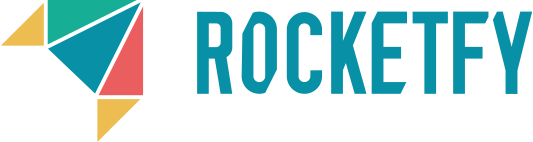

# Presentaciones duales de 1º DAW y 1º DAM del curso 2020 / 2021

Horarios, índices a los repositorios de alumnos y normas para las presentaciones de alumnos duales de **1º DAM** (Desarrollo de Aplicaciones Multiplataforma) y **1º DAW** (Desarrollo de Aplicaciones Web) del **IES Campanillas** (Málaga) del curso 2020 - 2021.

## Índice

* [Cuadrante horario de las presentaciones con índices a los repositorios](#cuadrante-horario-de-las-presentaciones-con-índices-a-los-repositorios)
* [Tiempo para la presentación](#tiempo-para-la-presentación)
* [Contenido de la presentación](#contenido-de-la-presentación)
* [Formato de la presentación](#formato-de-la-presentación)
* [Lugar de la presentación](#lugar-de-la-presentación)

## Cuadrante horario de las presentaciones con índices a los repositorios

Cada alumno debe enlazar con el repositorio donde tiene su presentación.

### :calendar: Lunes 24 de mayo de 2021

##### 1ºDAM

* 10:15h [Buendía López, Jairo]()
* 10:25h [Gutiérrez Ramírez, Jesús María]()
* 10:35h [López Pérez, María de la Cruz]()
##### 1ºDAW
* 10:45h [Mancera Taboada, Juan Pedro]()

##### 1ºDAW
* 10:55h [Aranda Jiménez, Francisco Javier]()
* 11:05h [Gómez Becerra, Daniela]()
* 11:15h [Morón Jurado, José Manuel]()
* 11:45h [Olalla Pérez, Jesús María]()
* 11:55h [Riveros Racero, Francisco Javier](https://github.com/FJ-Riveros)

### :calendar: Martes 25 de mayo de 2021 - 1ºDAM

* 10:15h [De Abrisqueta Rangel, Ander]()
* 10:25h [Reyes Podadera, Pablo Jesús]()

* 10:35h [García Gómez, Sergio]()
* 10:45h [Morales Aragón, Marcos]()

* 10:55h [Salmerón Robles, Gonzalo José]()
* 11:05h [Sevilla Valderrama, Fernando Iván]()

#### Properly
* 11:15h [Andrés Domínguez, Javier]()

#### TopDigital
* 11:45h [Egea Hermoso, Adrián](https://github.com/AdrianEgeaHermoso/Presentacion_TopDigital.git)

#### Vicox
* 11:55h [Estrada Cobo, José Manuel]()

#### Securekids
* 12:05h [Millán Rebollo, Noel]()

## Tiempo para la presentación

La presentación durará aproximadamente 5 minutos, dejando otros 5 minutos para un turno de preguntas.

Los alumnos de una misma empresa deberán estar juntos a la hora que le toque al primero de esa empresa para poder hablar juntos sobre la misma. Por ejemplo, todos los alumnos de Accenture deberán estar presentes a las 10:15h ya que esa es la hora a la que está citado el primer alumno de dicha empresa.

## Contenido de la presentación

La presentación debe tener, como mínimo, el siguiente contenido:

* Introducción a la empresa. Se debe hacer en común cuando en la misma empresa hay varios alumnos.
* Tareas desempeñadas con temporalización por semanas.
* Herramientas utilizadas.
* Conocimientos adquiridos por cada módulo profesional.
* Valoración de la experiencia dual por parte del alumno.

## Formato de la presentación
La presentación debe seguir las pautas explicadas en el módulo de Entornos de Desarrollo.

Se puede utilizar cualquier herramienta para elaborar la presentación. El alumno se puede apoyar en material multimedia si lo considera oportuno.

Independientemente de la herramienta utilizada para crear y mostrar la presentación, debe haber una versión en pdf en el repositorio de GitHub.

Cualquier material utilizado en la presentación debe estar disponible desde el repositorio de GitHub: presentación original, presentación en formato pdf, enlaces a videos, etc.

## Lugar de la presentación

Las presentaciones tendrán lugar en el **salón de actos de la incubadora** sita en C/ Frederick Terman,3. 29590, PTA.

Si te ha resultado útil este repositorio, por favor dale una :star:

